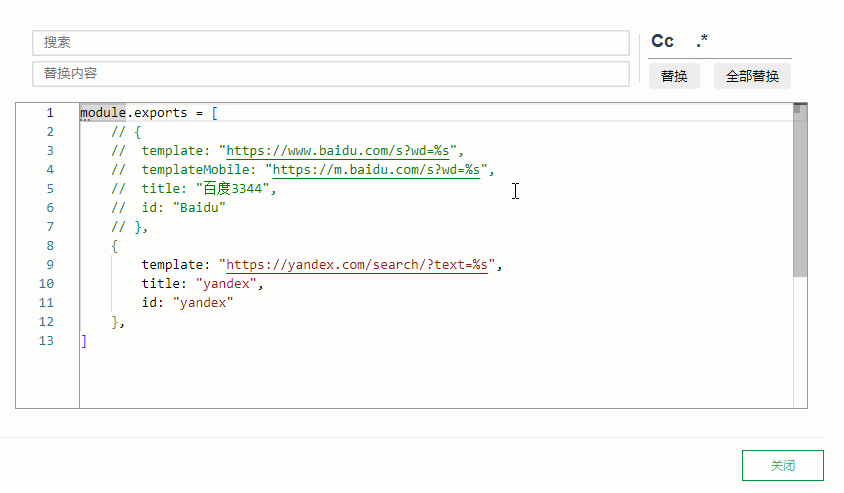

# 选区替换

> 一款简单的选择文本替换插件，支持正则

## 使用

选中文本，`右键 > 选区替换` 开始使用

> 要撤销操作，关闭对话框，回到编辑区正常Ctrl+Z即可

## 常见问题

### 输入框自动聚焦？

对话框打开时，内部的网页文档并没有获取焦点，所以输入框无法实现自动聚焦

## 参考

* [着色#example-interacting-with-the-editor-line-and-inline-decorations](https://microsoft.github.io/monaco-editor/playground.html?source=v0.48.0#example-interacting-with-the-editor-line-and-inline-decorations)
